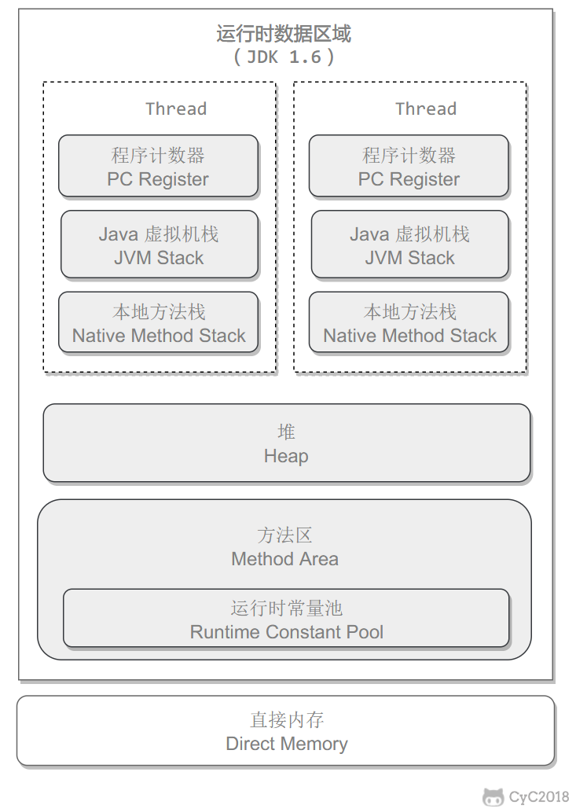
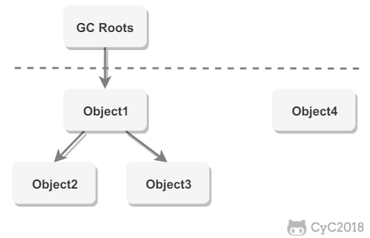

## 1. JVM内存模型
以下是JVM运行时的数据分区(摘自CS-Notes)
<div align="center">  </div><br>
JVM内存模型主要可以分为：
- 程序计数器
- 本地方法栈
- 虚拟机栈
- 虚拟机堆
- 方法区

### 1.1 程序计数器
程序计数器是记录虚拟机正在执行的字节码指令的地址
### 1.2 本地方法栈
本地方法栈主要是用来为本地方法服务的，比如一些用C或者C++编写的本地方法。
### 1.3 虚拟机栈
- java中每个方法的执行对应着一次方法入栈和弹栈的过程。这里的栈指的就是虚拟机栈。每个方法会在栈中会创建属于自己的栈帧，在栈帧中会存放方法的本地变量，以及对常量池的引用。
- 当过多的方法入栈，而栈的深度无法满足时，就会抛出StackOverFlowError。最典型的就是递归
- 栈的大小会动态扩展，当栈无法申请到内存空间时，就会抛出OuOfMemeryError。对于虚拟机每一个部分，如果申请不到内存，都会抛出这个异常。
### 1.4 虚拟机堆
堆就是存放新建对象的地方。也是GC的主要区域。堆内存主要分为新生代和老年代。主要是因为现代垃圾收集器主要都是分代收集，年轻代采用复制算法，老年代采用标记-整理算法。
<div align="center">  </div><br>
### 1.5 方法区
方法区主要存放常量，静态变量。方法区里有一很重要的区域叫运行时常量池，主要用于存放一些字面量和符号引用(比如String字符串字面量)。
## 2. JVM垃圾收集机制
### 2.1 判断哪些对象需要回收
#### 2.1.1 引用计数法
引用计数法是指，对每一个对象都有一个计数器，当对象被引用一次，计数器会加一；如果计算器归零，说明对象不再被引用，因此需要被垃圾收集器回收。
**一个令其无法使用的缺点：**
无法解决循环引用问题。如果A引用了B，B也引用了A，则计数器永远无法归零。就无法回收。

```java
public class Test {
    public Object instance = null;
    public static void main(String[] args) {
        Test a = new Test();
        Test b = new Test();
        a.instance = b;
        b.instance = a;
        a = null;
        b = null;
        doSomething();
    }
}
```
#### 2.1.2 可达性分析法
通过GC Roots开始遍历，可以通过引用链到达的对象时可达的，无法到达的对象时不可达的，可以认为没有被使用，需要回收。
**哪些对象可以当作GC Roots：**
- 方法中局部变量引用的对象；
- 常量引用的对象；
- 静态变量引用的对象
- JNI 方法中引用的变量
<div align="center">  </div><br>

### 2.2 引用类型
### 2.2 回收算法
### 2.3 垃圾收集器
## 3.内存分配机制和回收策略
### 3.1 Minor GC和Full GC
### 3.2 内存分配机制
### 3.3 Full GC条件
## 4. JVM类加载机制
### 4.1 类加载过程
### 4.2 类加载器
### 4.3 双亲委派模型
