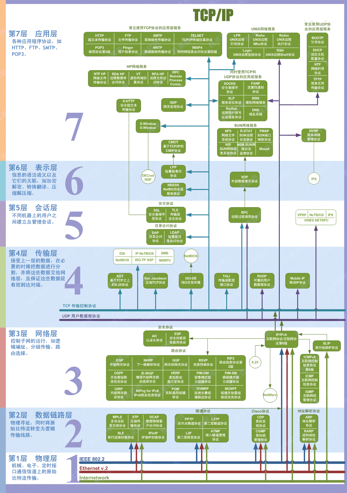
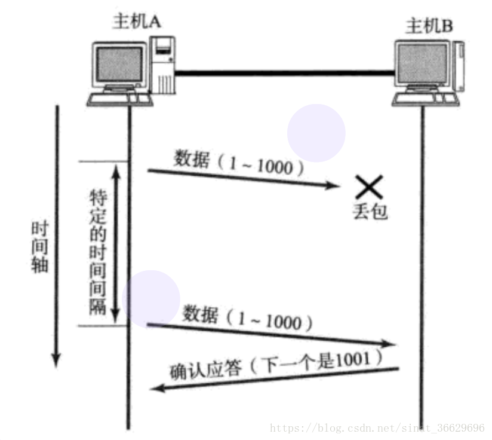
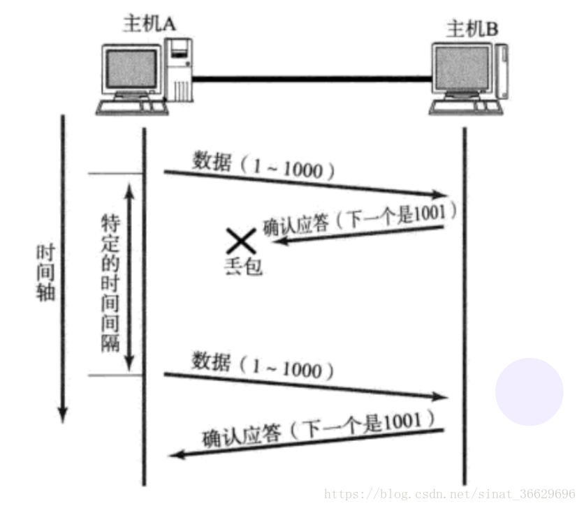
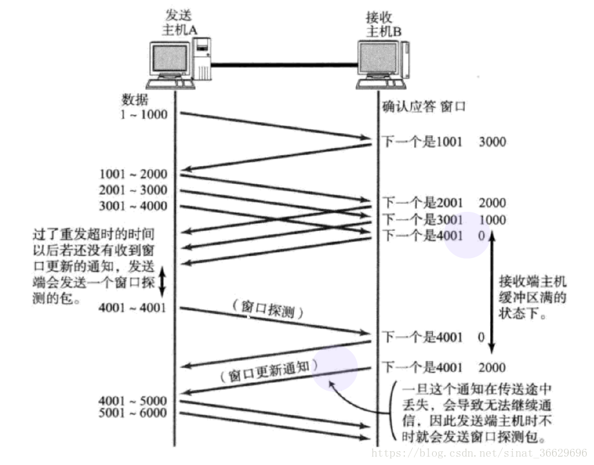
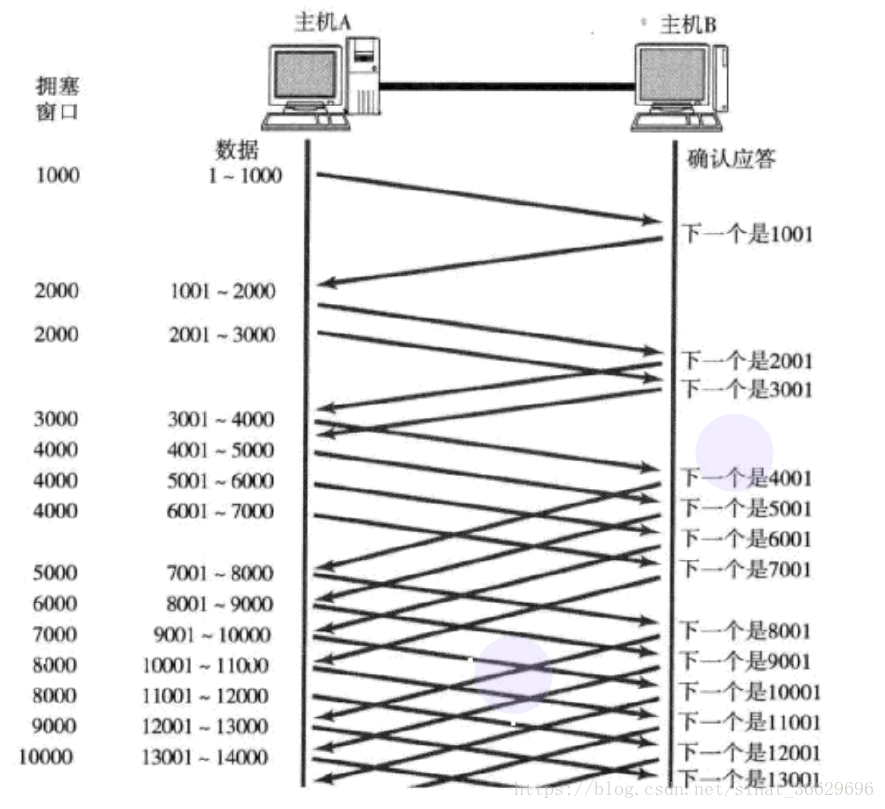
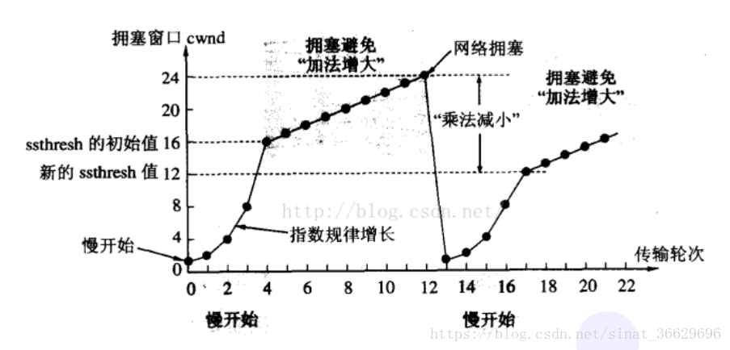
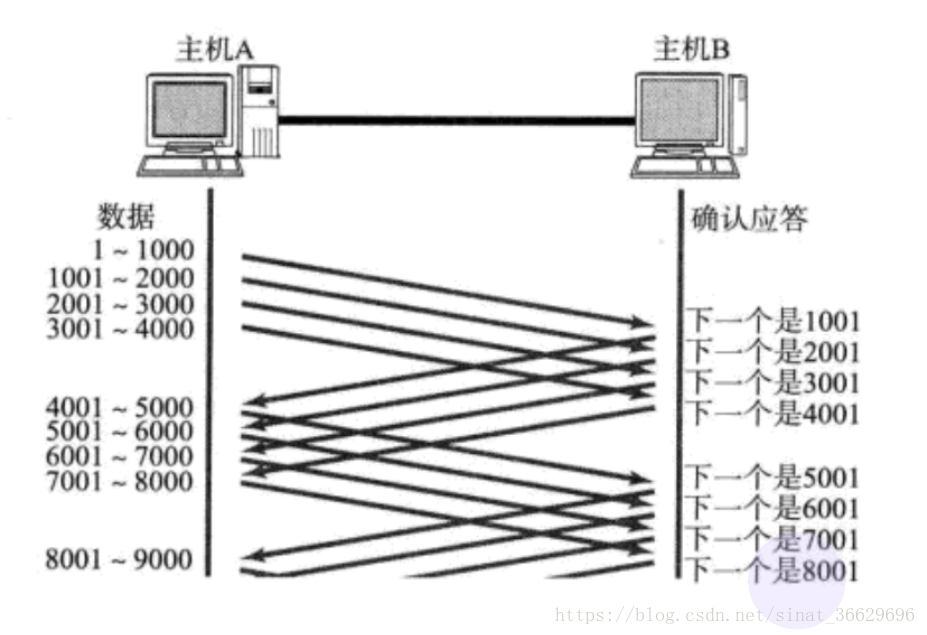
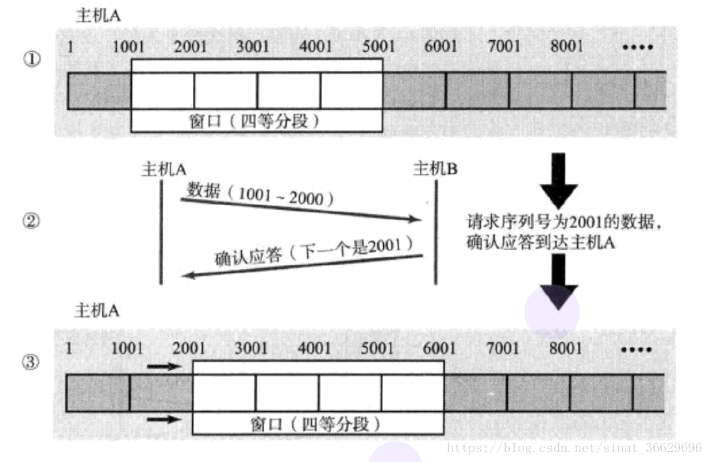

# TCP/IP协议
TCP/IP协议现在互联网的基础，它规定互联网中各个计算机或者节点的通信协议和传输协议。其中，IP是网络层的协议；TCP是传输层的协议。下图是计算机网络七层网络模型图。

## 1. 网络层和数据链路层的对比
数据链路层支持的是互联网中两台物理设备之间通信。比如，从北京到莫斯科，需要坐飞机，坐高铁。则北京机场和莫斯科机场之间就是通过飞机航线通信，这就是数据链路；但是下飞机还要坐高铁到目的地，高铁也是一种链路。则从出发地到目的地之间的通信就是网络层提供的，因为跨了飞机和高铁两种链路。IP就像是机票和火车票，它会告诉乘客(数据)要到什么地方。

## 2. TCP协议
TCP协议是全程是连接管理协议，顾名思义，就是来控制互联网节点之间的连接。
TCP是面向连接的，可靠的流式协议。流意味着采用TCP通信时，虽然发送端可以控制发送的顺序。但是数据是源源不断的"流"向接收端。
TCP是面向连接的，意味着每次通信之前，必须要先建立连接，才能通信。
TCP的可靠性主要表现在：
- 连接管理
- 确认应答
- 超时重传
- 流量控制
- 拥塞控制
TCP在可靠性的基础上，也提供多种机制实现高效性：
- 快重传
- 滑动窗口
- 延迟应答
- 捎带应答
### 2.1 连接管理
TCP的连接管理主要就是体现在连接和断开上，分别对应着"三次握手"和"四次挥手"。
#### 2.1.1 三次握手
客户端和服务端通信之前必须先建立连接，连接的过程就是三次握手。

1. 客户端向服务端发送连接请求；
2. 服务端收到连接请求，向客户端发送确认，表示已收到，可以连接；
3. 客户端接收到服务端的确认，向服务端发送确认，表示收到确认，建立连接。

> 1. TCP服务器进程先创建传输控制块TCB, 时刻准备接受客户端进程的连接请求, 此时服务器就进入了 LISTEN（监听）状态 
2. TCP客户端进程也是先创建传输控制块TCB, 然后向服务器发出连接请求报文，此时报文首部中的同步标志位SYN=1, 同时选择一个初始序列号 seq = x, 此时，TCP客户端进程进入了 SYN-SENT（同步已发送状态）状态。TCP规定, SYN报文段（SYN=1的报文段）不能携带数据，但需要消耗掉一个序号。 
3. TCP服务器收到请求报文后, 如果同意连接, 则发出确认报文。确认报文中的 ACK=1, SYN=1, 确认序号是 x+1, 同时也要为自己初始化一个序列号 seq = y, 此时, TCP服务器进程进入了SYN-RCVD（同步收到）状态。这个报文也不能携带数据, 但是同样要消耗一个序号。 
4. TCP客户端进程收到确认后还, 要向服务器给出确认。确认报文的ACK=1，确认序号是 y+1，自己的序列号是 x+1. 
5. 此时，TCP连接建立，客户端进入ESTABLISHED（已建立连接）状态。当服务器收到客户端的确认后也进入ESTABLISHED状态，此后双方就可以开始通信了。

#### 2.1.2 四次挥手
断开连接的过程就是四次挥手。

1. 首先客户端向服务端发送断开连接请求；
2. 服务端收到断开连接请求，向客户端发送确认信号，表示已收到请求，可以断开；
3. 服务端向客户端发送断开连接请求；
4. 客户端收到请求，向服务端发送确认，表示可以断开；
5. 客户端等待2MSL的时间断开连接。

> 1. 客户端进程发出连接释放报文，并且停止发送数据。 
   释放数据报文首部，FIN=1，其序列号为seq=u（等于前面已经传送过来的数据的最后一个字节的序号加1），此时客户端进入FIN-WAIT-1（终止等待1）状态。 TCP规定，FIN报文段即使不携带数据，也要消耗一个序号。 
2. 服务器收到连接释放报文，发出确认报文，ACK=1，确认序号为 u+1，并且带上自己的序列号seq=v，此时服务端就进入了CLOSE-WAIT（关闭等待）状态。 
   TCP服务器通知高层的应用进程，客户端向服务器的方向就释放了，这时候处于半关闭状态，即客户端已经没有数据要发送了，但是服务器若发送数据，客户端依然要接受。这个状态还要持续一段时间，也就是整个CLOSE-WAIT状态持续的时间。 
3. 客户端收到服务器的确认请求后，此时客户端就进入FIN-WAIT-2（终止等待2）状态，等待服务器发送连接释放报文（在这之前还需要接受服务器发送的最终数据） 
4. 服务器将最后的数据发送完毕后，就向客户端发送连接释放报文，FIN=1，确认序号为v+1，由于在半关闭状态，服务器很可能又发送了一些数据，假定此时的序列号为seq=w，此时，服务器就进入了LAST-ACK（最后确认）状态，等待客户端的确认。 
5. 客户端收到服务器的连接释放报文后，必须发出确认，ACK=1，确认序号为w+1，而自己的序列号是u+1，此时，客户端就进入了TIME-WAIT（时间等待）状态。注意此时TCP连接还没有释放，必须经过2∗MSL（最长报文段寿命）的时间后，当客户端撤销相应的TCB后，才进入CLOSED状态。 
6. 服务器只要收到了客户端发出的确认，立即进入CLOSED状态。同样，撤销TCB后，就结束了这次的TCP连接。可以看到，服务器结束TCP连接的时间要比客户端早一些。

**这里有四个问题**：
1. 为什么是三次握手？两次行不行？
2. 为什么是四次挥手？
3. 为什么客户端需要等待2MSL时间断开连接？
4. 建立连接后，客户端发生故障怎么办？

**答**：
1. 三次握手是为什么保证客户端和服务端建立连接，并且是和想要的节点连接。两次握手不行，因为如果是在客户端向服务端发送的连接请求因为网络原因阻塞了，服务端没有收到这个请求。之后客户端没有收到确认，就会再发送一次请求，这时成功建立连接并完成通信。但是，之前阻塞的请求可能会在某个时间发送到服务端，此时服务端以为又是客户端的请求，就会给出响应，这样就浪费了资源
2. 四次挥手是因为TCP通信是全双工的，以为着客户端和服务端可以同时向对方发送数据，这样当一方没有数据传输需要关闭，但另一方数据可能还没传输完，这时就必须保证双方都没有数据传输，才能断开连接。
3. TCP断开连接请求断开的一方必须等待2MSL时间的原因是因为客户端发送给服务端的ACK确认可能丢失，这时服务端以为没有收到确认，就会再次发送FIN请求断开，这时就必须保证客户端没有断开，并给出确认。而这FIN和ACK一来一回正好是2MSL的时间。
4. 服务端会维护一个保活计数器，每当接收到客户端请求，就是重置这个计数器；如果两个小时内没有收到客户端请求，就会每个一段时间(大概75分钟)发送一个探测报文，如果连续10次没有收到应答，就断开连接。
### 2.2 确认应答
确认应答也就是ACK机制是指当客户端每发送一组数据和，服务端都会给出确认应答，表示已收到同时告诉客户端下一次该发哪个数据包。比如发送1-1000，则服务端给出ACK为1001，表示下次从1001开始发。
### 2.3 超时重传
超时重传也是TCP协议可靠性的体现之一。当数据传输过程中发生丢包，比如客户端发送了数据但是没有收到响应，这时可能是请求数据丢失，也可能是服务端确认信号的丢失。这时，客户端就会重新发送请求。如果是确认信号丢失，这时服务端就会收到大量重复消息。利用序列号完成去重。

### 2.4 流量控制
流量控制是指当根据接收端的实际接收能力，发送端决定每次发送数据的长度。每一次接收端在给发送端发送确认信号时，都会在TCP中携带当前接收端的窗口大小，发送端基于接收端的窗口大小决定发送多少数据。

### 2.5 拥塞控制
同流量控制不同，拥塞控制是防止数据链路瞬时产生大量流量。因此当一开始发送数据的时候，先少发一点数据探探路，之后再慢慢增加发送量。这就是拥塞控制的的慢启动机制。

这时就出现一个概念，拥塞窗口：

- 初始为1

- 每接收到一个确认，增加1

- 每次发送数据时，将拥塞窗口和接收到的接收窗口大小比较，取小。

  但是这里的窗口增加是指数级的，这样很快会造成拥塞。于是，拥塞窗口有个阈值，当增加超过这个阈值时，就是由指数级增长变为线性增长。

  
  
### 2.6 滑动窗口
由2.2的确认应答机制可以发现，服务端如果对每次的的请求都应答一次，这样的效率和开销都非常大。这时滑动窗口机制出现。滑动窗口机制允许接收端对一段请求集中做响应。

只有在窗口中的数据才允许被发送，如果数据被确认应答，窗口就会滑向下一个数据，因此叫做滑动窗口。

**问题**：
如果发生了掉包怎么办？
**答**：
如果是没有收到确认ACK，则可以忽略，因为之后的ACK也会告诉发送端需要发送那些数据；
如果是请求数据丢包，这时就会立马向发送端发送ACK。比如1000-2000丢失，这时服务端就会频繁发送1001的ack，客户端接收到三次同样ACK之后，就会知道数据丢失，重新发送1000-2000数据。
这就是快速重传机制。
